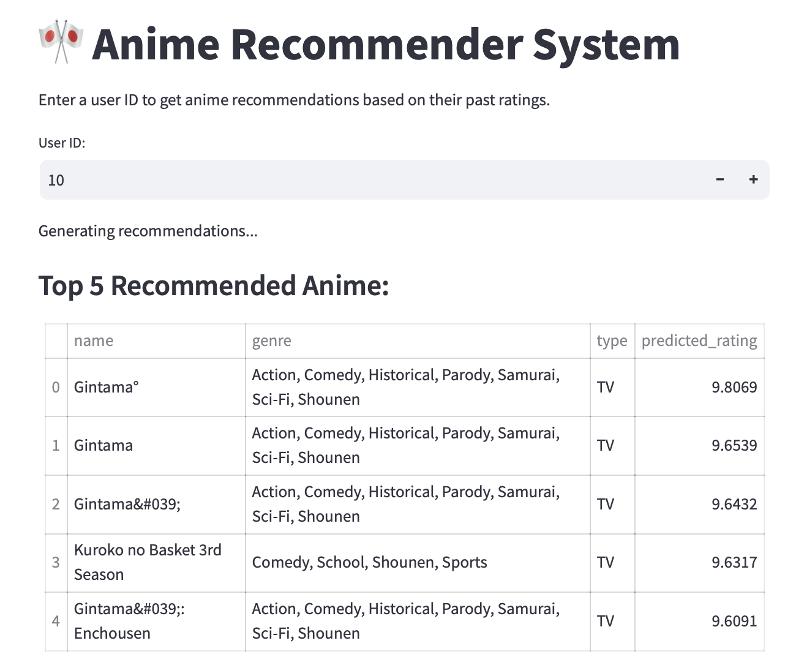

#  Anime Recommender System

A hybrid recommender system that predicts how users would rate anime titles they haven’t seen, using collaborative filtering and content metadata. This project was completed as part of the **ExploreAI Unsupervised Learning module**.

---

##  Table of Contents
- [ Dataset Overview](#-dataset-overview)
- [ Project Objective](#-project-objective)
- [ Models & Techniques](#-models--techniques)
- [ Evaluation](#-evaluation)
- [ Streamlit App](#️-streamlit-app)
- [ Requirements](#requirements)
- [ Folder Structure](#-folder-structure)
- [ Next Steps](#-next-steps)
- [ Status](#-status)

---

##  Dataset Overview

The dataset is adapted from MyAnimeList and includes:

- `anime.csv`: Anime metadata (name, genre, rating, type, etc.)
- `train.csv`: User ratings for anime
- `test.csv`: User-anime pairs for which predictions are required
- `submission.csv`: Format for Kaggle submission

Source: [Original Anime Dataset on Kaggle](https://www.kaggle.com/datasets/CooperUnion/anime-recommendations-database)

---

##  Project Objective

> Build a recommendation system that predicts how a user might rate an anime title they have not watched, based on historical rating patterns.

---

##  Models & Techniques

###  Collaborative Filtering
- **SVD (Singular Value Decomposition)** from `surprise` library
- Grid search for tuning:
  - `n_factors`: 100
  - `lr_all`: 0.01
  - `reg_all`: 0.1

###  Streamlit App
- Interactive web app to generate personalized anime recommendations based on `user_id`

---

##  Evaluation

| Metric        | Score      |
|---------------|------------|
| Local RMSE    | ~1.14      |
| Kaggle RMSE   | **1.14313** |
| Kaggle Rank   | #6 (solo submission) |

---

##  Streamlit App

To launch the recommendation app locally:

streamlit run streamlit_app.py
- Then open http://localhost:8501 in your browser.




## Requirements

- To install required packages, run:
    **pip install -r requirements.txt**
    **pip install pandas streamlit scikit-surprise**

## Folder Structure

```
anime-recommender-system-project-2025/
├── anime.csv
├── train.csv
├── test.csv
├── submission.csv
├── svd_submission.csv
├── anime_recommender_notebook.ipynb
├── streamlit_app.py
└── README.md

```

## Next Steps

- Add content-based filtering using genres
- Explore hybrid models combining content & collaborative scores
- Deploy Streamlit app to Streamlit Cloud or Hugging Face Spaces

##  Status

- Project completed and submitted
- GitHub Repo: ExploreAI-unsupervised-learning

---

